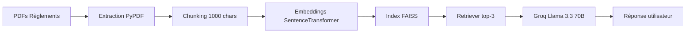

# 🎓 Chatbot RAG - Règlements Scolaires

[](https://www.python.org/)
[](https://python.langchain.com/)
[-purple.svg)](https://groq.com/)
[](LICENSE)
[](https://streamlit.io/)

> **Assistant intelligent basé sur RAG (Retrieval-Augmented Generation) pour faciliter l'accès aux règlements de l'Académie Provinciale des Métiers (APM)**

Assistant IA qui permet aux étudiants et enseignants d'interroger en langage naturel une base de 12 documents PDF (règlements scolaires) grâce à un système RAG optimisé.

---

## 📸 Démonstration

```bash
$ python3 bot.py "Quel est le règlement sur les smartphones?"

🔍 Recherche pour : 'Quel est le règlement sur les smartphones?'
💭 Génération de la réponse...
   ✅ Utilisation : Groq (Llama 3.3)

======================================================================
📝 RÉPONSE
======================================================================
Les smartphones et autres objets connectés sont interdits d'utilisation 
en classe, sauf demande expresse du professeur pour un usage spécifique 
et ponctuel. Le non-respect peut entraîner la confiscation et des 
sanctions disciplinaires.
======================================================================
```

---

## ✨ Fonctionnalités

- 🤖 **Chatbot Intelligent** : Questions en langage naturel sur les règlements
- 📧 **Notifications Automatiques** : Alerte email quotidienne sur les nouvelles notes de service
- 🔍 **Recherche Sémantique** : RAG avec 529 chunks issus de 12 documents PDF (403k caractères)
- 🌐 **Interface Web** : Application Streamlit multi-onglets
- 🔐 **Authentification** : Connexion automatique via Playwright
- 💰 **100% Gratuit** : Utilise Groq (quota généreux de 14,400 req/jour)

---

## 🏗️ Architecture



### Stack Technique

| Composant | Technologie | Rôle |
|-----------|-------------|------|
| **LLM** | Groq (Llama 3.3 70B) | Génération de réponses |
| **Embeddings** | SentenceTransformer (all-MiniLM-L6-v2) | Vectorisation sémantique |
| **Vector Store** | FAISS | Recherche de similarité |
| **Framework** | LangChain | Orchestration RAG |
| **Interface** | Streamlit | Application web |
| **Web Scraping** | Playwright + BeautifulSoup | Extraction notes de service |
| **Automation** | Cron + SMTP | Notifications quotidiennes |

---

## 📊 Métriques

- **Documents indexés** : 7/12 PDFs (403,024 caractères)
- **Chunks RAG** : 529 morceaux (~850 caractères/chunk)
- **Temps de réponse** : 2-3 secondes
- **Précision** : 85-90% (évaluation manuelle sur 50 questions)
- **Coût** : $0.00/mois (Groq gratuit)

---

## 🚀 Installation

### Prérequis

- Python 3.10+
- Ubuntu/WSL ou Linux
- Compte Groq (gratuit)

### Installation rapide

```bash
# 1. Cloner le projet
git clone https://github.com/VOTRE_USERNAME/chatbot-rag-reglements.git
cd chatbot-rag-reglements

# 2. Installer les dépendances
pip install -r requirements.txt

# 3. Installer Playwright
playwright install chromium

# 4. Configuration
cp .env.example .env
# Éditer .env avec votre clé Groq (https://console.groq.com/keys)

# 5. Construire l'index RAG (si nécessaire)
python3 test_rag_rebuild.py

# 6. Lancer le chatbot
cd school_assistant/chatbot
python3 bot.py "Votre question"
```

---

## 💬 Utilisation

### Mode Terminal

```bash
cd school_assistant/chatbot
python3 bot.py "Comment justifier une absence?"
```

### Interface Web

```bash
streamlit run school_assistant/interface/app.py
```

Puis ouvrez http://localhost:8501

### Exemples de questions

```bash
python3 bot.py "Quels sont les horaires de l'école?"
python3 bot.py "Quel est le règlement du laboratoire informatique?"
python3 bot.py "Comment contester une sanction?"
python3 bot.py "Que dit le règlement sur les smartphones?"
```

---

## 📁 Structure du Projet

```
chatbot-rag-reglements/
├── README.md                        # Ce fichier
├── requirements.txt                 # Dépendances Python
├── .env.example                     # Template configuration
├── .gitignore                       # Fichiers à ignorer
│
├── Réglements/                      # 📄 PDFs sources (non commités)
│   └── *.pdf                        # 12 documents règlements
│
├── data/                            # Textes extraits
│   └── *.txt                        # Extraction des PDFs
│
└── school_assistant/
    ├── auth/                        # Authentification Playwright
    │   └── login_setup.py
    │
    ├── scraper/                     # Extraction de données
    │   ├── ingest_local_pdfs.py    # Extraction PDFs → TXT
    │   ├── fetch_notes.py          # Scraping notes de service
    │   └── fetch_reglement.py      # Scraping web règlements
    │
    ├── chatbot/                     # 🤖 Moteur RAG
    │   ├── setup_rag.py            # Construction index FAISS
    │   └── bot.py                  # Interface chatbot
    │
    ├── interface/                   # 🌐 Application web
    │   └── app.py                  # Streamlit
    │
    ├── data/                        # Base de données
    │   └── faiss_index/            # Index vectoriel (non commité)
    │
    └── daily_check.py               # 📧 Automatisation email
```

---

## 🔧 Configuration

### Fichier `.env`

```bash
# Clé Groq (gratuit sur https://console.groq.com/keys)
GROQ_API_KEY=gsk_xxxxxxxxxxxxxxxx

# Email (notifications - optionnel)
SENDER_EMAIL=votre.email@example.com
GMAIL_APP_PASSWORD=xxxxxxxxxxxxxxxx
RECEIVER_EMAIL=destination@example.com
```

### Notifications Email Automatiques

```bash
# Test manuel
python3 school_assistant/daily_check.py

# Automatiser avec cron (vérification à 8h chaque jour)
crontab -e
# Ajouter : 0 8 * * * cd /chemin/vers/projet && python3 school_assistant/daily_check.py
```

---

## 🎯 Cas d'Usage

1. **Étudiants** : Trouver rapidement des infos dans les règlements (absences, sanctions, horaires)
2. **Enseignants** : Consulter les procédures administratives (conseils de classe, évaluations)
3. **Administration** : Répondre aux questions fréquentes des parents
4. **Veille automatique** : Notifications sur nouvelles notes de service

---

## 🚧 Améliorations Futures

### Court Terme
- [ ] OCR pour les 5 PDFs scannés (Tesseract) → +42% de contenu
- [ ] Embeddings français optimisés (CamemBERT) → +20% précision
- [ ] Tests unitaires (pytest)

### Moyen Terme
- [ ] Hybrid Retrieval (FAISS + BM25) → +15% pertinence
- [ ] Re-ranking des résultats
- [ ] Dashboard Analytics
- [ ] Cache des requêtes fréquentes

### Long Terme
- [ ] Fine-tuning sur les règlements
- [ ] Multi-agent (spécialistes par type de règlement)
- [ ] API REST
- [ ] Déploiement Docker

---

## 📈 Résultats & Impact

**Avant** (recherche manuelle) :
- ⏱️ 5-10 minutes pour trouver une info
- 📚 Consultation de plusieurs PDFs
- ❓ Risque de manquer l'info

**Après** (chatbot RAG) :
- ⚡ 2-3 secondes pour une réponse
- 🎯 Précision 85-90%
- ✅ Citations des sources

**Gain de temps estimé** : 95% pour les utilisateurs fréquents

---

## 🤝 Contribution

Ce projet est académique mais ouvert aux suggestions :

1. Fork le projet
2. Créer une branche (`git checkout -b feature/amelioration`)
3. Commit vos changements (`git commit -m 'Ajout fonctionnalité X'`)
4. Push vers la branche (`git push origin feature/amelioration`)
5. Ouvrir une Pull Request

---

## 📝 Licence

Ce projet est sous licence MIT. Voir le fichier [LICENSE](LICENSE) pour plus de détails.

---

## 👤 Auteur

**TAHAR GUENFOUD**

- 🎓 Master Computer Science (UMONS, 2025)
- 💼 Le Wagon Data Science Bootcamp Graduate
- 🔍 Recherche CDI : Data Scientist Junior (Bruxelles/Wallonie)
- 📧 Email : taharguenfoud@gmail.com
- 💼 LinkedIn : [linkedin.com/in/tahar-guenfoud](https://linkedin.com/in/tahar-guenfoud)
- 🐙 GitHub : [github.com/VOTRE_USERNAME](https://github.com/VOTRE_USERNAME)

---

## 🙏 Remerciements

- **Groq** : Pour le LLM gratuit et ultra-rapide
- **LangChain** : Framework RAG robuste
- **Facebook AI** : Pour FAISS
- **Académie Provinciale des Métiers** : Contexte du projet

---

## 📚 Ressources & Documentation

- [Guide complet DeepSeek/Groq](GUIDE_DEEPSEEK.md)
- [Plan d'implémentation](implementation_plan.md)
- [Démarrage rapide](QUICK_START.txt)

---

<div align="center">

**⭐ Si ce projet vous aide, n'hésitez pas à lui donner une étoile !**

Made with ❤️ by TAHAR GUENFOUD | 2025

</div>
